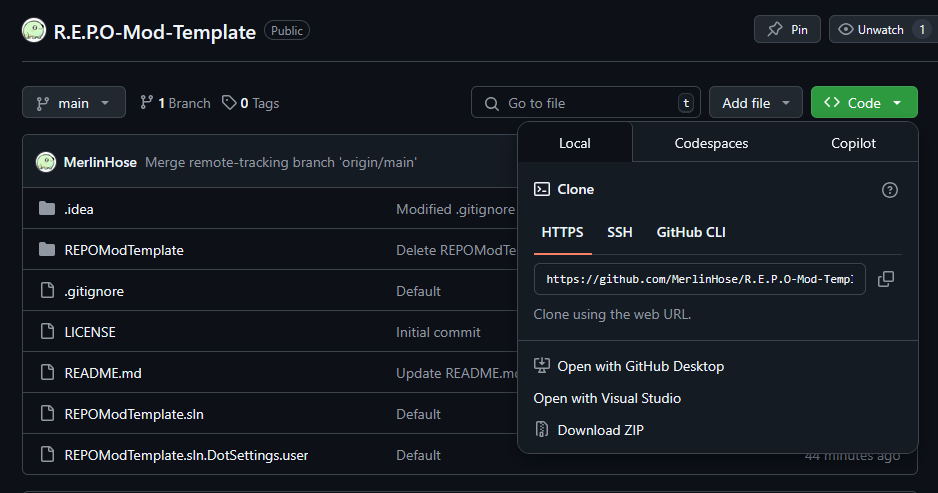
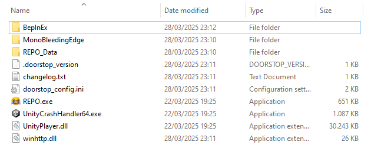
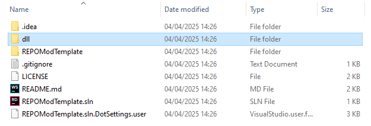
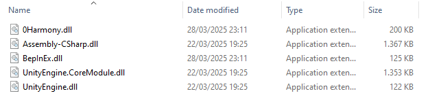
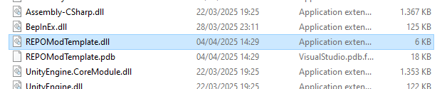

# Project Setup Guide

Welcome to the documentation for setting up and using this modding project. This guide will walk you through downloading, configuring, and building the project using **BepInEx** and patching your game with the necessary `.dll` files.

## 📥 1. Download the Project

Clone the repository using Git or download it as a ZIP:

```bash
git clone https://github.com/MerlinHose/R.E.P.O-Mod-Template.git
```

Alternatively, click **"Code > Download ZIP"** and extract the folder.

[]()

## 🧰 2. Add BepInEx to the Project (R.E.P.O)

1. Download the correct version of **[BepInEx](https://github.com/BepInEx/BepInEx/releases)** (usually `BepInEx_x64` for most games).
2. Extract BepInEx into your game directory.

Your folder structure should look something like this:

```
/REPO
│
├── BepInEx/
├── .doorstop_version
├── changelog.txt
├── doorstop_config.ini
├── winhttp.dll
└── ...
```

[]()

## 📦 3. Add Required `.dll` Files

Copy all required `.dll` plugin and library files into the appropriate folders:

- Create a new Folder `dll/` in the main project directory:

[]()

- Add the needed dll's to the `dll/` folder. 
  - The required files are:
    - ```
      REPO\BepInEx\core\0Harmony.dll
      ```
    - ```
      REPO\BepInEx\core\BepInEx.dll
      ```
    - ```
      REPO\REPO_Data\Managed\Assembly-CSharp.dll
      ```
    - ```
      REPO\REPO_Data\Managed\UnityEngine.dll
      ```
    - ```
      REPO\REPO_Data\Managed\UnityEngine.CoreModule.dll
      ```

[]()

## ⚠ 3.5 Errors in the solution explorer (add references to the dlls in your project)

- Right-click on the project in the Solution Explorer and select **"Add > Reference..."**.
- In the Reference Manager, click on **"Browse"** and navigate to the `dll/` folder you created.
- Select the required `.dll` files and click **"Add"**.

## 🛠 4. Mod / Patch and Build

Make your changes to the project (code, patches, etc.).

Then build the project using your IDE (like Visual Studio or Rider). This will output your compiled `.dll` to the `bin/Debug` or `bin/Release` folder (depending on build config).

[]()

## ➕ 5. Add Your DLL to BepInEx

Take the built `.dll` from your `bin/` folder and place it into the `BepInEx/plugins/` folder in your game directory.

Once everything is set, launch the game, and BepInEx should automatically load your plugin on startup.

## ✅ You're Done!

You should now have your mod running in the game via BepInEx. Happy modding!

If you run into issues, check the BepInEx log file located at:

```
/GameFolder/BepInEx/LogOutput.log
```

## 🔗 Useful Links

- [BepInEx GitHub](https://github.com/BepInEx/BepInEx)
- [Harmony (for patching)](https://github.com/pardeike/Harmony)